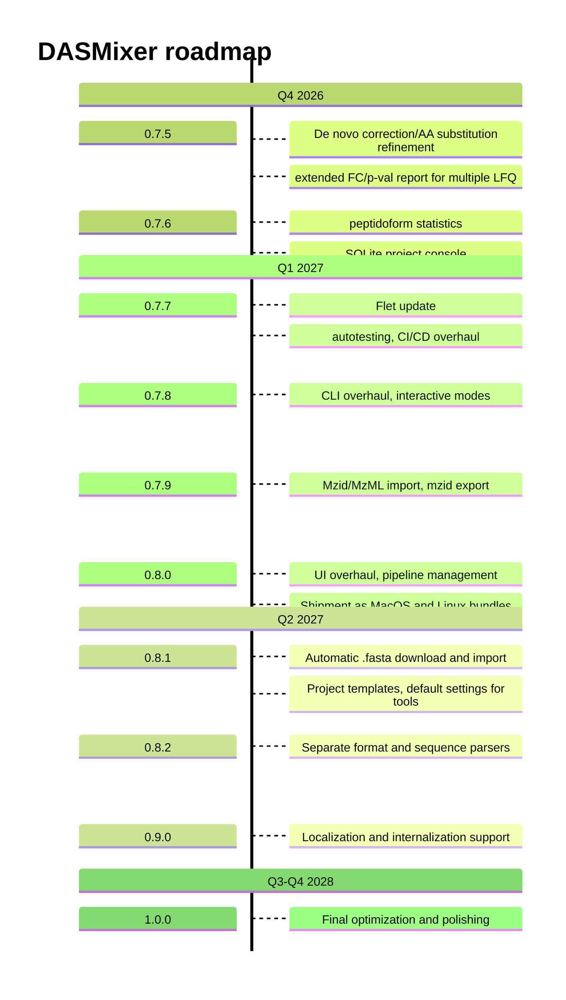

# DASMixer development roadmap

```mermaid
---
config:
  theme: 'forest'
---
timeline TD
title DASMixer roadmap
section Q4 2026
    0.7.5 : De novo correction/AA substitution refinement
          : extended FC/p-val report for multiple LFQ
    0.7.6 : peptidoform statistics
          : SQLite project console
section Q1 2027
    0.7.7 : Flet update
          : autotesting, CI/CD overhaul
    0.7.8 : CLI overhaul, interactive modes
    0.7.9 : Mzid/MzML import, mzid export
    0.8.0 : UI overhaul, pipeline management
          : Shipment as MacOS and Linux bundles
section Q2 2027
    0.8.1 : Automatic .fasta download and import
          : Project templates, default settings for tools
    0.8.2 : Separate format and sequence parsers
    0.9.0 : Localization and internalization support
section Q3-Q4 2028
    1.0.0 : Final optimization and polishing
```